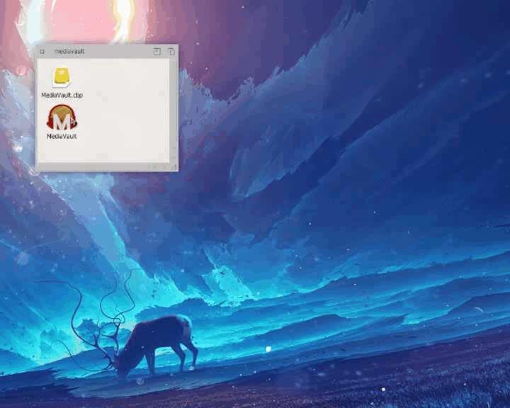

# mediavault

MediaVault is an open source desktop application, for AmigaOS 4, which can be
used to discover online radio stations. The selected radio station can be
streamed using a player, i.e. AmigaAmp 3.

When Mediavault is started at the top of the window there are a few fields
that can be used to discover radio station based on their name, genre, country
and spoken language. By clicking on "Discover" button a list of relevant radio
stations will show up.

To listen a radio station, double click on it's line, and AmigaAmp3 will
start, playing the radio station. After that, you can close MediaVault.

Vision
--------------------------
My plan for MediaVault is to create an application which users will use to:
- discover online radio stations,
- create a list of favorite radio stations
- discover online podcasts,
- follow podcasts and get information for new episodes
- access content (music, video etc.) from local DLNA media servers, like
  Plex, Jellyfin etc.
- have a modern look and feel, with images and photos, where is possible
- create a clean, easy to read code, with good quality and the best practices
  for others to get inspired

Requirements
--------------------------
* oo.library v1.13 by Tuomas Hokka
* jansson.library v2.12.1 by Simon Tyrrell
* AmigaAmp3 v3.29 by Thomas Wenzel

I would like to thank
--------------------------
- Tuomas Hokka for developing oo.library and listen to my requirements, ideas.
- Simon Tyrrell for developing jansson.library and his help on debugging
  issues I had during development, listen to my ideas.
- Thomas Wenzel for developing the best audio player for AmigaOS
- Everyone at os4coding.net, who helped with proposals and solutions on
  my questions.
- Simon Archer who develops CodeBench, which helped me a lot during the
  development of this application
- AmigaOS 4 developers who develop the best OS out there.
- Daniel "trixie" Jedlicka who worked on a lot of features, fixes and 
  refactoring of MediaVault, providing proposals, ideas and information
  to my questions

Without all the above MediaVault would not be possible.

Code and bug reporting
--------------------------
The project is open source and you can find the code at:
https://github.com/walkero-gr/mediavault

If you have any requests or you would like to report any problems you found,
you can do that at:
https://github.com/walkero-gr/mediavault/issues

Changelog
--------------------------
v1.2.0 - 2021-05-27
* Added Unicode conversion to system charset on radio station names 
  - Thanks to Daniel "trixie" Jedlicka
* Now the application registers properly and can get requests from other 
  apps, like Exchanger - Thanks to Daniel "trixie" Jedlicka
* Now the MediaVault can jump to different screens - Thanks to Daniel 
  "trixie" Jedlicka
* Added better error manipulation when there were API response errors 
  - Thanks to Daniel "trixie" Jedlicka
* Now the size and the position of the window can be saved by the Popup 
  Gadget - Thanks to Daniel "trixie" Jedlicka
* Added code to detach the listbrowser before change it's data. That's the 
  way it should be done
* Restructured code to reduce the duplicated code in radiofuncs.c. Now, one
  method is used instead of three separated that had pretty much the same 
  code. Better code, less problems.
* A lot of refactoring, removing global variables.
* Reduced a lot of duplicated code.                                                  
* Now the default radio station number increased to 50. The response is also 
  much faster - Thanks to Tuomas Hokka and oo.library 1.13 fixes
* Changed the way classes and gadgets are initiallized - Thanks to Daniel 
  "trixie" Jedlicka

v1.1.1 - 2021-05-15
* Changed the required oo.library version to 1.12
* Fixed a bug on requesting radio stations without using the filters

v1.1.0 - 2021-05-13
* Added a message requester for messages to the user
* The "Discover" button changes to "Discover more" after the first search,
  so to load more radio stations results. If the user change a filter, then
  it resets.
* Added more options at the Genre select box
* Added more options at the countries and languages select boxes
* Now the retrieved radio stations list doesn't include the marked as broken
  stations
* Added Trending list of radio stations
* Added Popular list of radio stations
* Changed columns' widths on listbrowsers to be weighted

v1.0.0 - 2021-04-30
* Initial release
* Radio stations discovery is working
* Station url can be loaded in AmigaAmp3
